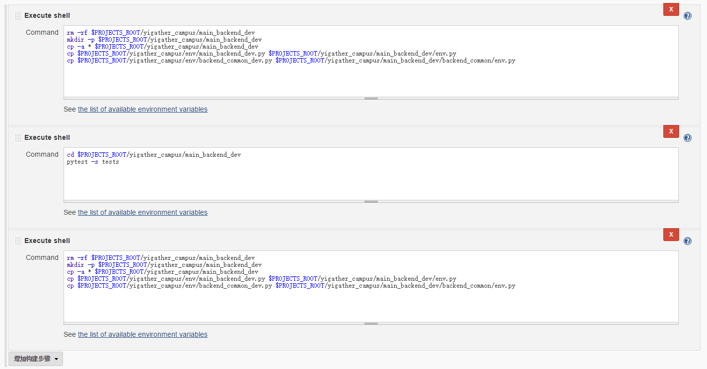

项目开发规范说明
========

目录
----
1. [项目准备阶段](#项目准备阶段)
 - [开发环境](#开发环境)
 - [代码托管软件](#代码托管软件)
 - [GIT工作流程](#git工作流程)
2. [代码目录组织结构（仅供参考）](#代码目录组织结构（仅供参考）)
 - [后端common目录结构](#后端common目录结构)
 - [后端应用服务器目录结构](#后端应用服务器目录结构)
 - [前端vue+vuex构建SPA目录结构](#前端vue+vuex构建spa目录结构)
 - [公共代码部分怎样进行引用？](#公共代码部分怎样进行引用？)
 - [为什么要实现前后端分离](#为什么要实现前后端分离)
3. [代码规范](#代码规范)
4. [API接口规范](#api接口规范)
5. [自动化构建](#自动化构建)
6. [自动化测试](#自动化测试)
7. [自动化部署](#自动化部署)
8. [Python开发相关](#python开发相关)


项目准备阶段
--------

#### 开发环境
后端：python+flask服务器框架+pip包管理（gitlab管理私有服务package）
前端：es6+sass+html+vue框架+npm包管理（gitlab管理私有服务package）

#### 代码托管软件
使用gitlab，到时每个人分配一个gitlab的账号，项目负责人创建一个组group，为项目名称，然后管理后台，官网，pc端主站点，手机端主站点等各自创建前后端代码的子项目project，方便单独发布和管理版本。例如：


#### GIT工作流程

参考[http://www.cnblogs.com/cnblogsfans/p/5075073.html](http://www.cnblogs.com/cnblogsfans/p/5075073.html)

代码目录组织结构（仅供参考）
--------

#### 后端common目录结构
* config（公共配置，例如database，api服务等）
* const（常量配置，例如sex，错误码等）
* controllers（公共控制器）
* database（数据库迁移脚本，仅在开发环境下使用）
* docs（公共文档，例如错误码，枚举类型等）
* events（事件）
* exceptions（异常）
* middlewares（中间件）
* models（模型）
* services（服务）
* 其他文件（.gitignore，env.example.py，env.py，migrate.py等）

#### 后端应用服务器目录结构
* common（公共部分代码）
* config（配置，例如缓存、日志、服务器）
* controllers（控制器）
* docs（文档）
* tests（测试用例）
* 其他文件（.gitignore，env.example.py，env.py，app.py，requirement.txt等）

#### 前端vue+vuex构建SPA目录结构
* build（构建脚本）
* config（构建配置）
* dist（构建目标目录）
* node_modules（构建所需依赖包）
* src（源代码）
* src/assets（资源文件，包括images，scss等）
* src/components（页面组件）
* src/store（数据存储）
* src/views（页面组织）
* src/app.js（app入口文件）
* static（静态文件）
* index.html（入口模板文件）
* 其他文件（.gitignore，package.json等）

#### 公共代码部分怎样进行引用？
我现在是通过git submodule的方式进行管理，暂时没什么其他问题，使用方法可参考[http://www.jianshu.com/p/d433d3417a19](http://www.jianshu.com/p/d433d3417a19)。ps. submodule更新时，每个依赖它的项目都要手动更新（其实不更新也可以，就像模块升级了，你根据自己使用情况决定是否升级）

#### 为什么要实现前后端分离
1. 前端开发复杂度变大，前后端分离有助于分工，例如前端编写服务器端渲染模板，后端还没有写页面路由，就会导致前端看不到页面进行布局调试。
2. 随着手机APP，手机web网页，pc web网页等多种客户端设备，数据和表现的分离，有利于接口的重用，而使用服务器端渲染模板，只能渲染模板对应的网页。
3. 怎么实现？nginx配置URL匹配规则，/api前缀的交给api服务器，其他返回index.html，再交由前端router系统进行相应view组件的渲染。

代码规范
--------

#### 文件夹和文件
统一小写，下划线分割单词（reset_password，controllers），复数
#### 类名和命名空间
大驼峰命名，单数。（AuthController）
#### 函数
统一小写，下划线分割单词。（set_default）
#### 变量
统一小写，下划线分割单词。（user_name）
#### 常量
统一大写，下划线分割单词。（HTTP_OK = 200）
#### html属性和class、id值
统一小写，中划线分隔单词。（data-id,create-btn）
#### URL
统一小写，下划线分割单词，单数。（/user/reset_password）
#### 数据库
统一小写，下划线分割单词，一般采用项目名称。（my_project）
#### 数据表
采用命名空间_表名格式，统一小写，下划线分割单词，复数。（core_users，core_user_addresses）
#### 字段，数据表字段或者json的key
统一小写，下划线分割单词（user_name）
#### 其他
cache的key或者session的key等其他，可以根据个人喜好，但建议统一小写，下划线分割单词，例如user_access_token。

API接口规范
--------

API请求URL遵循 http://xxx.domain.com/api/model/action 的规范，其中xxx表示不同子项目，domain表示主项目，/api作为前缀，model表示操作的资源，action表示对资源做的操作，如create，update，get，list，delete。

API返回数据结构统一如下：
```
{
    "errcode": 0,
    "errmsg": "success",
    "result": xxx,
}
//errcode=0代表没有错误，否则errcode为相应错误码，errmsg为错误信息提示，result为成功时返回的数据，不限定数据结构。
```

请求资源列表时，可以用page和rows指定请求第几页资源，每页返回结果数，返回数据结构统一如下：
```
{
    "errcode": 0,
    "result": [
        {"x": 1, "y": 2},
        {"x": 3, "y": 4},
    ],
    "total_rows": 123456 //结果总数量
}
```

自动化构建
--------

前端和后端的自动化构建，通过jenkins来完成。构建，一般分为开发环境和正式环境，前端根据不同环境，进行不同的构建步骤，后端因为是脚本语言，不需要编译打包，所以开发环境下只需要运行测试用例，通过即可。

这里介绍一下我在项目中的配置，仅供参考
1. 填写项目名称和描述和一些构建配置，默认在构建的服务器上运行。


2. 配置源代码，gitlab需要安装GIT插件。因为使用了submodule，所以额外行为那里，添加上对submodule的递归更新，submodule的证书使用跟主模块一致。


3. 配置构建触发器，需要安装gitlab插件。这里是关键，当一个改变推送到gitlab时，push时会触发gitlab的web hook url，从而触发构建。正式环境建议不要dev分支merge到master分支就自动触发构建，最好手动触发构建来发布。


4. 构建。先把gitlab的代码复制到一个临时目录，合并上环境变量配置文件，然后运行测试用例，通过测试则把上线的代码准备到一个临时目录。


5. 构建后操作，构建失败发送邮件通知相关人。


6. 前端步骤4的构建脚本跟后端不一样，其他配置一样。先在构建目录安装新的依赖包，把gitlab代码除了node_modules以外，复制到一个临时目录，再把node_modules转移过去临时目录（这样做的原因是因为复制node_modules耗时太大），最后运行npm run dev或者npm run build。


自动化测试
--------

除了人工测试，强烈建议代码api层面编写unit test，确保接口传入参数和返回结果无误，关于python后端的unit test套件，详见[https://docs.python.org/2/library/unittest.html](https://docs.python.org/2/library/unittest.html)

对于测试驱动开发TDD，不强行要求，但建议在接口开发完之后，补上单元测试，主要为了保证在回归测试中及时发现问题，增强代码的健壮性。自动化测试部分也会交给Jenkins处理。

对于测试中，如果不想影响数据库数据的，可以把测试用例包在database的transition中，在测试用例运行结束时进行回滚。但是如果系统有调用其他系统接口，可能会导致数据不一致的情况，所以根据情况谨慎选择。

自动化部署
--------

为了实现自动化部署，方便管理版本的发布和回滚，多台服务器发布，运行环境等，自动化部署使用[mina](https://github.com/mina-deploy/mina)，不过目前采用比较简单的方案，通过jenkins把build之后的目标代码，通过rsync同步到各个服务器（这个需要创建多配置项目），并重启服务器。


Python开发相关
--------
* [服务器](#服务器)
* [路由](#路由)
* [控制器](#控制器)
* [中间件](#中间件)
* [会话](#会话)
* [日志](#日志)
* [缓存](#缓存)
* [事件](#事件)
* [异常处理](#异常处理)
* [数据迁移](#数据迁移)
* [ORM](#orm)
* [其他服务](#其他服务)
* [常用库列表](#常用库列表)

#### 服务器
配置文件位于config/server.py，初始化文件app.py。主要配置项如下，详见[http://flask.pocoo.org/docs/0.11/api/#application-object](http://flask.pocoo.org/docs/0.11/api/#application-object)

名称|意义|类型|默认值|必需
----|----|----|----|-----
host|绑定主机|string，ip|127.0.0.1|否
port|绑定端口|number|80|否
debug|是否调试模式|boolean|True|否
options|服务器选项|object|{}|否
secret_key|密钥|string|None|是
app_name|APP名称|string||是

注意，host、port、debug、options这几个参数只在开发阶段生效，生产环境务必使用uwsgi配置和运行。

怎样生成一个好的密钥，提供一种简单的生成方式，密钥务必保存在环境变量中获取。详见[http://flask.pocoo.org/docs/0.11/quickstart/](http://flask.pocoo.org/docs/0.11/quickstart/)
```
>>> import os
>>> os.urandom(24)
'\xfd{H\xe5<\x95\xf9\xe3\x96.5\xd1\x01O<!\xd5\xa2\xa0\x9fR"\xa1\xa8'
```

#### 路由
配置文件位于controllers/routes.py，初始化文件app.py。初始化函数为init_app，注入了current_app，配置规则跟flask一致。但由于把路由单独出来配置，所以没有采用route装饰器这种方式定义，详见[http://flask.pocoo.org/docs/0.11/api/#url-route-registrations](http://flask.pocoo.org/docs/0.11/api/#url-route-registrations)

#### 控制器
控制器文件存放在controllers目录下，一般一个实体对应一个文件，处理函数写成类方法classmethod，被routes路由引用，一般继承BaseController。

#### 中间件
中间件文件存放在common/middlewares目录下，被controller处理函数调用。文件定义装饰器函数，一般用来控制访问权限，防止CSRF攻击，记录日志等，也可以用来做依赖注入，例如注入当前user对象。

#### 会话
配置文件存放在config/session.py，初始化文件app.py，使用flask扩展库flask_session，配置项主要包括session公共配置，和使用不同驱动时相应驱动的配置。详见[https://pythonhosted.org/Flask-Session/](https://pythonhosted.org/Flask-Session/)

注意，一般开发环境下使用加密的cookie或者使用文件保存session来保存session数据即可，生产环境建议使用redis或者memcache之类的分布式内存服务器保存。不过随着前后端分离，服务器基本不用专门维护session，而进行无状态的通信。

#### 日志
配置文件存放在config/logger.py，初始化文件app.py，使用python系统自带日志系统，一般在flask里面直接app.logger调用即可。配置项如下，详见[https://docs.python.org/2/library/logging.html](https://docs.python.org/2/library/logging.html)

注意，一般开发环境下使用控制台输出即可，生产环境采用日志文件输出，默认名称为app_name.log，可以在env.py中修改。不过，在使用uwsgi运行服务器时，也可以在uwsgi的配置中实现。
```
//采取这种方式写日志时，必须每晚夜晚12点正重启服务器，用来切分日志
daemonize = /home/xxx/projects/yigather_campus/logs/main.log.@(exec://date +%%Y-%%m-%%d)
log-reopen = true
```

#### 缓存
配置文件存放在config/cache.py，初始化文件app.py，使用flask底层框架的cache系统，配置项如下，详见[http://werkzeug.pocoo.org/docs/0.11/contrib/cache/](http://werkzeug.pocoo.org/docs/0.11/contrib/cache/)

名称|意义|类型|默认值|必需
----|----|----|----|-----
driver|使用的驱动|string，枚举|file，redis，memcache等|是
cache_dir|driver为file时，缓存存放目录|string|../cache|否
options|驱动的参数|object||是

#### 事件
事件类的定义放在后台common部分的events目录下，使用blinker库实现，flask框架自带的信号系统也是基于它的。

事件基类BaseEvent定义了基本的触发和处理方法，一般自定义的事件只需要继承BaseEvent，并实现自己的handle方法即可。详见[http://pythonhosted.org/blinker/](http://pythonhosted.org/blinker/)
```
class BaseEvent():
    触发事件：
        send(sender,**args)
    参数：
        sender：发送者
        args：发送参数

    处理事件：
        handle(sender,**args)  
    参数：
        sender：发送者
        args：发送参数
```
注意，因为文件定义的是类，所以建议在events目录下__init__.py下导出事件的实例，调用时直接events.custom_event.send(sender)。

#### 异常处理
异常的处理，除了代码中直接try，except处理之外，还可以直接raise一个自定义错误，由app统一处理，例如返回包含错误码和错误信息的json。

未捕获处理的异常都会交给后台common部分的exceptions目录下的__init__.py处理，在app.py文件进行初始化调用，底层调用flask的register_error_handler函数。

自定义异常继承Exception类，并实现自己的handle方法即可，异常参数可在初始化函数__init__中定义，例如错误码，错误信息。详见[https://docs.python.org/2/tutorial/errors.html](https://docs.python.org/2/tutorial/errors.html)

```
class CustomException(Exception):
    处理异常：
        handle(self)  
    参数：
        self：异常自身对象
```

#### 数据迁移
数据迁移文件放在common部分的database目录下，没用什么框架，是使用ORM框架的DDL部分进行操作，仅在开发环境下执行，可以保持数据的干净，不会出现旧数据导致的bug。一般一个数据迁移文件，操作包含
* 销毁旧的数据表
* 根据ORM的字段定义创建新的表
* 初始化系统数据或者测试数据，初始化数据可以用csv文件保存。

生产环境下强烈不建议进行数据迁移操作（主要是避免删除线上数据），除非你知道自己在做什么，数据迁移脚本在测试环境运行过了。

#### ORM
ORM框架主要负责封装DML接口，增加代码的可读性和可维护性（代码里面直接拼接sql语句很难看，而且容易出错）。ORM主要性能开销在于代码接口到SQL语句的转换上，但目前的业务性能瓶颈还不在ORM的开销上，所以暂时先使用ORM，以后遇到qps高要求的时候再考虑其他解决方案。

至于使用哪个ORM框架，个人觉得主流，一直在升级和维护，性能不会太差的就好，如[sqlalchemy](http://www.sqlalchemy.org/)，[peewee](http://docs.peewee-orm.com/en/latest/index.html)，个人没有亲测过，暂时使用peewee框架。

#### 其他服务
* 短信SMS服务
* 订单服务
* 授权认证服务
* 微信API服务
* utils工具函数

#### 常用库列表
* Flask：服务器后端主框架
* bcrypt：bcrypt加密算法，用于加密密码
* flask-login,flask-principal：用户授权和认证，角色权限
* flask-session：接入不同session驱动的库
* blinker：接入事件系统的库
* flask-uploads：文件上传库
* pytest：测试用例
* Mysql-python：连接mysql驱动
* peewee：orm框架
* pycrypto：密码类库
